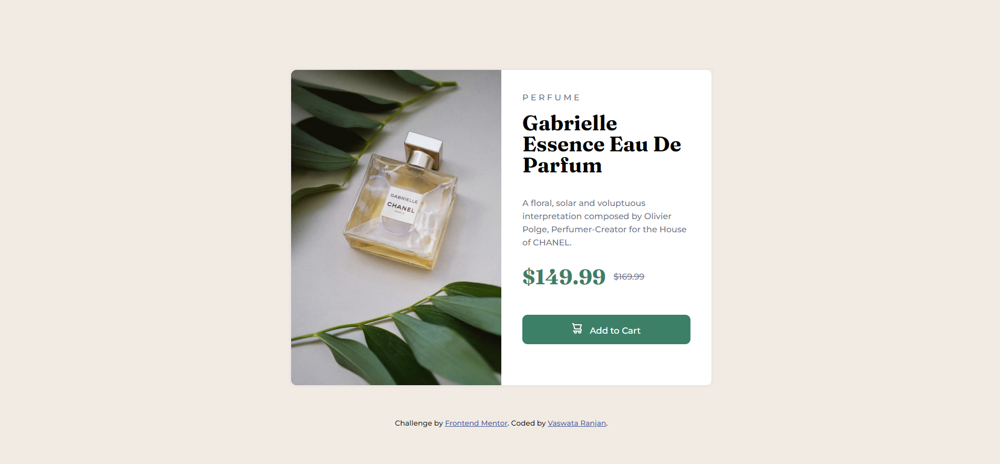

# Frontend Mentor - Product preview card component solution

This is a solution to the [Product preview card component challenge on Frontend Mentor](https://www.frontendmentor.io/challenges/product-preview-card-component-GO7UmttRfa). Frontend Mentor challenges help you improve your coding skills by building realistic projects. 

## Table of contents

- [Overview](#overview)
  - [The challenge](#the-challenge)
  - [Screenshot](#screenshot)
  - [Links](#links)
- [My process](#my-process)
  - [Built with](#built-with)
  - [What I learned](#what-i-learned)
  - [Continued development](#continued-development)
  - [Useful resources](#useful-resources)
- [Author](#author)
- [Acknowledgments](#acknowledgments)


## Overview

### The challenge

Users should be able to:

- View the optimal layout depending on their device's screen size
- See hover and focus states for interactive elements

### Screenshot



### Links

- Solution URL: [Solution on my Github Repository](https://github.com/Vaswata/product-preview-card-component)
- Live Site URL: [Netlify Site](https://product-preview-card-component-cc902f.netlify.app/)

## My process

### Built with

- Semantic HTML5 markup
- CSS custom properties
- Flexbox
- CSS Grid
- Mobile-first workflow

### What I learned

By making this project I have learnt how to change images when the screen size changes on web designing, along-with hover functions.

```html
<picture class="image">
  
</picture>
```
```css
#product-image {
  content: url("images/image-product-mobile.jpg");
}
```

### Continued development

Will further work on more complex CSS methods and also JavaScript.

### Useful resources

- [Resource 1](https://developer.mozilla.org/en-US/docs/Web/CSS/CSS_Backgrounds_and_Borders/Box-shadow_generator) - This helped me for creating custom box-shadows.
- [Resource 2](https://www.folkstalk.com/tech/how-to-change-image-based-on-screen-size-with-code-examples/) - This site helped me in changing image sizes of different screen widths.

## Author

- Website - [Vaswata Ranjan](https://github.com/Vaswata)
- Frontend Mentor - [@Vaswata](https://www.frontendmentor.io/profile/Vaswata)

## Acknowledgments

I would like to thank Udemy, MDN, as well as other sites I mentioned in the report which helped me in creating this project.
